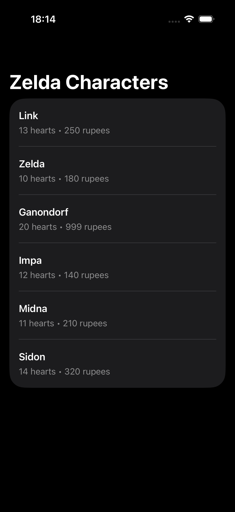
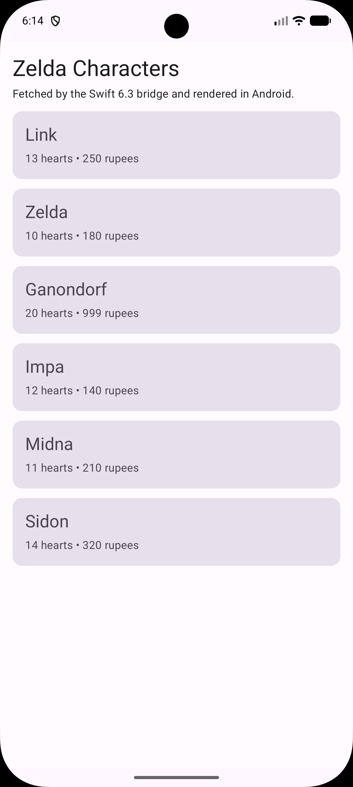

# TriForceDemo

<p align="center">
  
</p>

Monorepo showing how to share Swift code across:
- iOS with SwiftUI
- Android through JNI via [swift-java](https://github.com/swiftlang/swift-java)
- a Vapor backend

```text
ios/                        SwiftUI iOS app
android/                    Android app + Gradle bridge module
backend/                    Vapor backend
shared/
  SharedModels/             Shared Swift domain models
  SharedNetworkLayer/       Shared Swift HTTP client
```


## Repo Overview

### `shared/SharedModels`

Contains pure shared value types. In this demo that is primarily `PlayerCharacter`.

Characteristics:
- `Codable`
- `Hashable`
- `Sendable`
- no Apple-only frameworks

### `shared/SharedNetworkLayer`

Shared HTTP client built on top of `SharedModels`.

Characteristics:
- uses `URLSession`
- decodes JSON with `Codable`
- includes Android-specific environment handling where needed
- exports JNI bindings for Android builds

### `backend`

Vapor server that serves the shared models over HTTP. The Android and iOS demos both consume this backend.

### `android`

Compose app plus a small Gradle-managed bridge module that:
- builds the shared Swift packages for Android
- consumes generated Java bindings from `swift-java`
- packages the native Swift libraries into the APK

## Architecture

```text
iOS app ------------------------------------> SharedModels + SharedNetworkLayer
Backend (Vapor) ----------------------------> SharedModels
Android app -> generated Java -> JNI -> .so -> SharedModels + SharedNetworkLayer
```

Android is the interesting part here:
- `SharedModels` builds to `libSharedModels.so`
- `SharedNetworkLayer` builds to `libSharedNetworkLayer.so`
- `swift-java` runtime builds to `libSwiftJava.so`

Those native Android libraries are compiled with the official Swift 6.3 Android SDK artifact bundle.

The generated Java bindings load the matching native library name from each module.

## Android Bridge Design

This repo uses one native library per shared Swift module.

That means:
- `shared/SharedModels/Sources/SharedModels/swift-java.config` uses `nativeLibraryName = "SharedModels"`
- `shared/SharedNetworkLayer/Sources/SharedNetworkLayer/swift-java.config` uses `nativeLibraryName = "SharedNetworkLayer"`
- Android packages both `.so` files into the app

This is important: `nativeLibraryName` must match the actual produced `.so` basename.

Examples:
- `nativeLibraryName = "SharedModels"` -> Java will call `System.loadLibrary("SharedModels")` -> APK must contain `libSharedModels.so`
- `nativeLibraryName = "SharedNetworkLayer"` -> Java will call `System.loadLibrary("SharedNetworkLayer")` -> APK must contain `libSharedNetworkLayer.so`

If those drift apart, Android will fail at runtime with `UnsatisfiedLinkError`.

## Build Flow on Android

`android/swift-bridge/build.gradle` is the source of truth for Android packaging.

At build time it:
1. builds `shared/SharedModels` as a dynamic Android library
2. builds `shared/SharedNetworkLayer` as a dynamic Android library
3. pulls generated Java from each package's `.build/plugins/...` output
4. copies:
   - `libSharedModels.so`
   - `libSharedNetworkLayer.so`
   - `libSwiftJava.so`
   - required Swift runtime libraries
5. exposes those as `jniLibs` and Java sources to the Android project

The generated JNI artifacts live under:
- `shared/SharedModels/.build/plugins/outputs/...`
- `shared/SharedNetworkLayer/.build/plugins/outputs/...`
- `android/swift-bridge/build/generated/jniLibs/...`

## Prerequisites

- Xcode for iOS development
- [swiftly](https://swiftlang.github.io/swiftly/)
- Android SDK
- Android NDK
- Java 17

## Install Android Tooling

```sh
make android-install
```

This installs:
- Swift 6.3
- the official Swift 6.3 Android SDK artifact bundle
- required Android SDK components
- the `swift-java` runtime artifacts into Maven Local

## Quick Start

### Backend

```sh
make dev
```

The backend runs at `http://127.0.0.1:8080`.

Expected endpoint:
- `GET /characters`

### iOS

```sh
open ios/TriForceiOS.xcodeproj
```

### Android

```sh
cd android
./gradlew installDebug
```

Useful Android commands:

```sh
./gradlew :swift-bridge:copyJniLibs
./gradlew :app:assembleDebug
./gradlew :app:installDebug
```


## Final Result

<p align="center">
  
  
</p>

## Important Files

- [android/swift-bridge/build.gradle](android/swift-bridge/build.gradle)
  Android-side Swift build and JNI packaging
- [shared/SharedModels/Package.swift](shared/SharedModels/Package.swift)
  Makes `SharedModels` dynamic on Android
- [shared/SharedNetworkLayer/Package.swift](shared/SharedNetworkLayer/Package.swift)
  Makes `SharedNetworkLayer` dynamic on Android
- [shared/SharedModels/Sources/SharedModels/swift-java.config](shared/SharedModels/Sources/SharedModels/swift-java.config)
  Java package + native library name for `SharedModels`
- [shared/SharedNetworkLayer/Sources/SharedNetworkLayer/swift-java.config](shared/SharedNetworkLayer/Sources/SharedNetworkLayer/swift-java.config)
  Java package + native library name for `SharedNetworkLayer`
- [android/app/src/main/java/com/triforce/demo/android/MainActivity.kt](android/app/src/main/java/com/triforce/demo/android/MainActivity.kt)
  Compose demo screen calling into the shared Swift network layer

## Troubleshooting

### `UnsatisfiedLinkError`

If you see an error like:

```text
No implementation found for ...
is the library loaded, e.g. System.loadLibrary?
```

check these first:
- the Java binding and `.so` agree on `nativeLibraryName`
- the APK actually contains the expected `.so`
- stale JNI outputs are not being reused

This repo uses a `Sync` task for JNI copy so stale libraries are removed when names change.

### Generated Java still loads the old library name

Rebuild the bridge and app:

```sh
cd android
./gradlew :swift-bridge:copyJniLibs
./gradlew :app:assembleDebug
```

### Verifying packaged libraries

After a successful build, you should see:

```text
android/swift-bridge/build/generated/jniLibs/arm64-v8a/libSharedModels.so
android/swift-bridge/build/generated/jniLibs/arm64-v8a/libSharedNetworkLayer.so
android/swift-bridge/build/generated/jniLibs/arm64-v8a/libSwiftJava.so
```

## Notes

- The Android demo UI is Jetpack Compose.
- The character rows are intentionally full-width in the list UI.
- `SharedNetworkLayer` depends on `SharedModels`, so some Swift-side code is built in both package graphs on Android. That is acceptable here; the key point is that runtime packaging is split per module and JNI names stay consistent.
